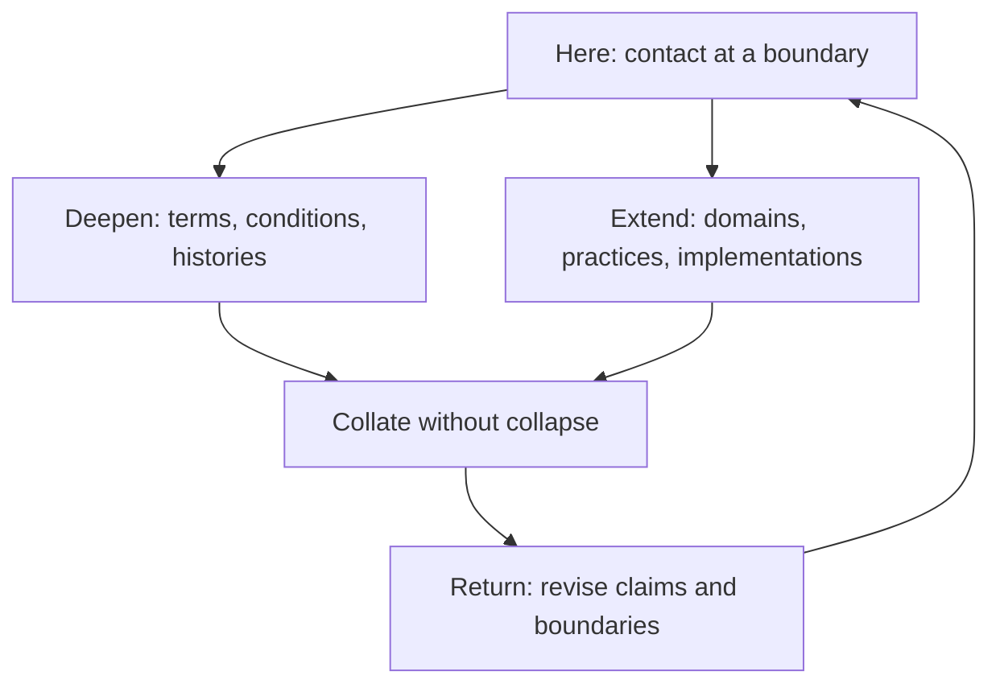

# Scientific Ontology｜存在境界論

## Can physics, cognition, ethics, organizations, AI, and peace be read on one boundary surface?

## 物理・認識・倫理・組織・AI・平和は、一つの境界面で読めるか

> Layer: Repository root
> Status: Public interface README / promotional entry
> Scope: conceptual invitation / international orientation / reading routes / repository navigation
> Language: English-first co-authoritative public interface; Japanese co-authoritative companion
> Public profile: P0 / repository entrance
> Claim strength: Mixed introductory overview; technical claims and non-claim boundaries are governed by linked owner documents
> Language relation: English and Japanese are co-authoritative for this README only. English is precision-led and internationally oriented; Japanese is accessibility-led and rhetorically lighter. Neither section is a translation subordinate to the other. Technical definitions, claim strength, and concept ownership remain governed by the linked canonical documents.

---

## 0. Here, at the boundary / 「ここ」という境界

> **Events happen at boundaries.**
>
> **Neither simply subjective nor simply objective, but where different modes of description come into contact.**

### A foothold called “here”

Descartes’s cogito—“I think, therefore I am”—remains a major philosophical foothold.

Scientific Ontology, however, shifts the emphasis from “I am” toward “here.”

The one who asks is already here.

Yet this “here” is not an isolated point cut off from the world. It is inseparably connected with body, history, other people, environments, and language. What comes into contact here changes what can be received, questioned, and done next.

We can test another foothold or climb another ladder. We can move into a different language, theory, culture, belief, or mode of description.

But if the living line back to “here” is lost, we may no longer be able to return with what we encountered and collate it again.

The point is therefore to keep a return path open while we explore.

Scientific Ontology reads this “here” neither as the inside of a subject nor as a position outside the world, but as a **boundary** through which contact, history, and return pass.

### Comparison without collapse

There are theories that place greater weight on subjective experience, theories that privilege objective description, and research traditions that attempt to work across those domains.

Scientific Ontology does not begin by declaring one of them the final language of reality. Instead, it attempts to provide a field in which different language games can be brought into contact while preserving their own conditions of validity, observational scope, claim strength, and limits.

Science should not be used as evidence for religion merely because the two share suggestive vocabulary. Religion should not be treated as a substitute for science. Literature should not be read as factual reporting.

But neither should we discard the possibility that each may be touching the world from a different angle.

What is genuinely shared? What remains different? What can be commensurated? Where does structural comparison end and metaphor begin? What remains unknown?

Scientific Ontology treats the boundary at which such comparisons become possible—and the rules required to make them without silently collapsing one domain into another—as an object of research in its own right.

> **事象は境界で起きている。**
>
> **主観でも客観でもなく、それらが混ざり合うところで。**

### 日本語｜「ここ」という足場

デカルトの「我思う、ゆえに我あり」は、大きな足場です。

けれど、存在境界論で主役になるのは、「我あり」よりも、まず「ここ」です。

問うている自分が、現にここにいる。

ただし、その「ここ」は、世界から切り離された孤立点ではありません。身体、履歴、他者、環境、言葉と断ちがたく結びつき、それらとの接触によって、次に何を受け取り、どう問い、どう動けるかが変わる場所です。

私たちは、別の足場を試すことも、別の梯子を登ることもできます。自分とは違う言語、理論、文化、信念、記述形式へ移ることもできます。

けれど、「ここ」との呼吸路を失えば、試したものを持って戻り、もう一度照合することができなくなる。

だから、帰り道を残したまま遊ぶ。

存在境界論は、この「ここ」を、自己の内側でも世界の外側でもなく、自己と世界が接触し、履歴と返りが通る**境界**として読みます。

### 日本語｜同一化せず、照合する

世の中には、主観に重心を置く理論も、客観に重心を置く理論も、その境界を横断しようとする研究もあります。

存在境界論は、それらのどれか一つを最終的な正しさとして選ぶのではなく、それぞれの言語ゲームが持つ成立条件、観測範囲、主張強度、限界を保ったまま、境界へ持ち寄って照合できる場を整えようとします。

科学を宗教の証拠にしない。宗教を科学の代用品にしない。文学を事実報告にしない。しかし、それぞれが別の角度から世界へ触れている可能性まで切り捨てない。

何が同じなのか。何が違うのか。どこまで通約できるのか。どこから先は比喩なのか。何がまだ分からないのか。

存在境界論は、その照合の場そのものを研究対象として扱います。

### From “here” into the v5 series

This same boundary orientation also applies within a single event.

Scientific Ontology does not need to choose the subjective side against the objective side, or the objective side against the subjective side, before it begins to observe an event.

An event becomes operationally important where external conditions, prior history, bodily and cognitive reception, action, resistance, and return meet. The boundary is therefore not a decorative line around already completed objects. It is a contact surface on which differences are produced, interpreted, acted upon, and returned into later conditions.

The v5 series carries this orientation out of the theory’s internal vocabulary and into language, literature, consent, accounting, institutions, AI, and interfaces. The framework is not first declared complete and only then applied. Implementation, criticism, failure, and residuals must be able to return to it and change what can still be claimed.

v5.0 is the opening release of that living series, not the completion of v5.

- [`Scientific Ontology Operational Outline`](00_Overview/Scientific_Ontology_Operational_Outline.en.md)
- [`Language, Meaning, and Communication Phase Studies`](05_Research_Notes/Language_Meaning_and_Communication_Phase_Studies/README.md)
- [`Consent Boundary and Sentence/Bit Asymmetry`](05_Research_Notes/Cross_Domain_Ontological_Notes/Consent_Boundary_and_Sentence_Bit_Asymmetry.ja.md)
- [`Literature as Worldmaking`](05_Research_Notes/Literary_Ontological_Notes/Literature_as_Worldmaking.ja.md)
- [`DSSI: Observation, Judgment, Sovereignty, and Responsibility Return`](05_Research_Notes/Social_Boundary_Notes/DSSI_Observation_Judgment_Sovereignty_and_Responsibility_Return.ja.md)

The DSSI item above is a research and implementation-boundary note. The DSSI application itself is **not** part of v5.0.

### 日本語｜「ここ」からv5系へ

この開始線は、新しい上位公理ではありません。

v4系までに積み上げてきた境界、接触、履歴、通信、返路を、いちばん短い運用語へ圧縮したv5系の開始線です。

外部だけで説明しない。自己だけにも回収しない。何が境界へ入り、どう受け取り、どう作用し、何が返ったかを見る。その接触履歴から、責任分界、意味、倫理、実装条件を引き直す。

v5系では、この運動を理論内部に留めません。言語、文学、同意、会計、制度、AI、インターフェイスへ持ち出し、そこで見えたものだけでなく、壊れたもの、説明できなかったもの、返ってこなかった残差まで研究側へ戻します。

したがってv5.0は完成版ではなく、**v5系を外部へ開く開幕版**です。v5.xでは研究・実装・外部照合を順次追加し、v5の枠そのものを組み替える必要が生じるまで発展させます。

DSSIについてv5.0に含まれるのは研究ノートと実装境界です。アプリケーション本体の公開は含まず、v5.1以降で条件が整った場合に別途判断します。

---

## 1. Open the dangerous question, then cut it back / 危ない問いを開き、自分で切り戻す

The repository sometimes begins with a deliberately provocative comparison.

A Feynman diagram lets physics write a process as particles, interactions, and arrows. Could a boundary-oriented conceptual system ask whether cognition, communication, institutions, or ethical action also exhibit describable structures of contact, transformation, and return?

The provocation is useful only if the cut follows immediately.

### The firebreak

Scientific Ontology does **not** claim:

- to be a replacement for standard physics;
- that one metaphysical relation maps one-to-one onto one physical interaction;
- that suggestive vocabulary establishes empirical identity;
- that diagrammatic resemblance proves ontological equivalence;
- or that mathematical symmetry can be presumed where none has been demonstrated.

Physics-adjacent language enters because the framework studies the conditions under which observation, distinction, interaction, and return become possible. Any stronger correspondence claim must be separately defined, formalized, and tested.

- [`Physics Correspondence Policy`](00_Overview/Physics_Correspondence_Policy.en.md)
- [`Physical and Cosmological Research Notes`](05_Research_Notes/Physical_Cosmological_Notes/README.md)

### What survives the cut

Once substitution, proof-by-metaphor, and one-to-one correspondence are removed, a narrower research question remains:

- What enters a boundary?
- What difference is produced there?
- What is retained as history?
- What can be communicated across a cut?
- What returns, to whom, and under what conditions?
- Which similarities remain structural, and which remain only heuristic?

These questions can travel across domains without pretending that the domains are identical. Their value lies in disciplined comparison, not in flattening different objects of knowledge into one vocabulary.

### 日本語｜問い、防火帯、切ったあとに残るもの

存在境界論は、ときに意図的に危ない問いから始めます。

ファインマン・ダイアグラムが粒子、相互作用、矢印によって過程を記述するなら、認識、通信、制度、倫理的行為にも、接触、変化、返りとして読める構造があるのではないか。

ただし、この問いは直後に自分で切り戻さなければなりません。

存在境界論は、標準物理学の代替ではありません。形而上の関係と物理現象の一対一対応を主張しません。似た語彙や図式があることを、経験的同一性や存在論的等価性の証明として扱いません。

物理に隣接する語彙と接触するのは、観測、区別、相互作用、返りが可能になる条件を扱うからです。それ以上の対応を主張するなら、個別に定義し、形式化し、検証する必要があります。

その防火帯を置いたあとにも、問いは残ります。

- 何が境界へ入ったのか。
- そこで何が差として生じたのか。
- 何が履歴として残ったのか。
- 切断を越えて何が通信できるのか。
- 何が、誰へ、どの条件で返るのか。
- どこまでが構造比較で、どこからが発見的な比喩なのか。

異なる領域を同一化せずに、この残った問いを持ち運ぶこと。それが存在境界論の比較方法です。

---

## 2. From metaphysical roots to boundary cognition / 形而上の根から境界認識へ

Scientific Ontology has metaphysical roots, but its public work does not stop at declaring what reality ultimately is.

Its operational movement is more modest and more demanding:

1. begin from a contact that has occurred;
2. identify the boundary on which a difference became available;
3. retain the history by which that difference was received;
4. distinguish observation, interpretation, judgment, and action;
5. preserve a route by which the result can return for later collation.

This movement turns metaphysical questions into problems of boundary cognition. It asks not only “what exists?” but also:

- from where did this become observable?
- under what conditions did it become meaningful?
- what was excluded by the cut?
- what authority does the resulting statement actually have?
- what would allow another reader or another domain to compare it without inheriting hidden premises?

The result is not a view from nowhere. It is a disciplined account of how a view becomes possible somewhere.

- [`Boundary Epistemological Critique`](01_Sat_Truth/Boundary_Epistemological_Critique.en.md)
- [`Entropy-Attributed Difference and Cognitive Axis Formation`](02_Raj_Beauty/Entropy_Attributed_Difference_and_Cognitive_Axis_Formation.en.md)
- [`Optional Axiom Modules as Cognitive Bridge`](03_Tam_Goodness/Optional_Axiom_Modules_as_Cognitive_Bridge.en.md)
- [`Meaning as Collation and Return Path`](05_Research_Notes/Language_Meaning_and_Communication_Phase_Studies/Meaning_as_Collation_and_Return_Path.en.md)

### 日本語｜形而上の根を、境界認識へ運ぶ

存在境界論には形而上の根があります。しかし、公開体系の仕事は「実在とは最終的に何か」を宣言することでは終わりません。

接触が起きたところから始める。差が読めるようになった境界を特定する。その差を受け取った履歴を残す。観測、解釈、判断、行為を分ける。そして、結果を後から照合し直せる返路を確保する。

この運動によって、形而上の問いは境界認識の問題になります。

何が存在するかだけでなく、どこから観測できたのか。どの条件で意味になったのか。その切断は何を落としたのか。その発言はどこまでの権限を持つのか。別の読者や別の領域が、隠れた前提まで引き受けずに比較するには何が必要か。

それは、どこにも属さない視点ではありません。ある場所で視点が成立した条件を、追跡可能にする試みです。

---

## 3. Where metaphysical roots meet operational surfaces / 形而上と形而下が接触するところ

The world presented to us is already being made.

Interfaces, organizations, laws, accounting systems, AI models, archives, and everyday language do not merely report a finished reality. They cut, name, rank, permit, refuse, remember, and forget. Each creates operational boundaries that alter what can happen next.

This is where metaphysical roots meet practical surfaces.

Questions about existence, difference, causality, responsibility, and return become concrete when a form accepts only one answer, an institution assigns authority, an AI system turns observations into recommendations, or an interface makes one action visible and another unreachable.

Scientific Ontology therefore moves into applications without treating them as secondary illustrations. Applications are contact surfaces that test the framework.

- In **AI**, the issue is how usefulness can remain bounded without transferring ownership of judgment.
- In **organizations**, the issue is how observation, decision, and responsibility can remain distinguishable.
- In **consent**, the issue is what a binary response preserves and what it compresses away.
- In **accounting and institutions**, the issue is what becomes legible, allocable, auditable, or invisible.
- In **peace and social design**, the issue is how a normative aim can become an operational specification without being reduced to procedure alone.
- In **literature**, the issue is how a made world can preserve compressed experience that factual reporting cannot carry in the same form.

The framework does not descend from a completed metaphysics to passive examples. The surface pushes back. Failed implementations, exclusions, resistance, and residuals become evidence about the limits of the original framing.

- [`AI Usefulness as a Boundary Function`](04_Applications/AI_Adaptation/AI_Usefulness_as_a_Boundary_Function.md)
- [`AI Adoption Collation Checklist`](04_Applications/Social_Boundary_Design/AI_Adoption_Collation_Checklist.md)
- [`Specification for Peace`](04_Applications/Social_Boundary_Design/Specification_for_Peace.en.md)
- [`Consent Boundary and Sentence/Bit Asymmetry`](05_Research_Notes/Cross_Domain_Ontological_Notes/Consent_Boundary_and_Sentence_Bit_Asymmetry.en.md)
- [`Literature as Worldmaking`](05_Research_Notes/Literary_Ontological_Notes/Literature_as_Worldmaking.en.md)

### 日本語｜形而上と形而下は、実装面で出会う

私たちの前にある世界は、すでに誰かの切断によって作られています。

インターフェイス、組織、法、会計、AI、アーカイブ、日常言語は、完成済みの現実を報告するだけではありません。名づけ、順位づけ、許可し、拒否し、記憶し、忘れることで、次に可能な行為そのものを変えます。

ここで、形而上の根と形而下の運用面が接触します。

存在、差、因果、責任、返りをめぐる問いは、入力欄が一つの答えしか受け付けないとき、制度が権限を配分するとき、AIが観測を推奨へ変えるとき、画面が一つの行為だけを見えるようにするとき、具体的な境界問題になります。

したがって応用は、理論のあとに添える例ではありません。理論を試し、押し返し、作り替える接触面です。

AIでは判断の所有権を渡さずに有用性を保てるか。組織では観測、決定、責任を分けられるか。同意では一ビット化によって何が落ちるか。会計と制度では何が可視化され、配分され、監査され、不可視になるか。平和では規範を手続だけへ還元せずに運用仕様へ書けるか。文学では事実報告と異なる仕方で圧縮経験を保持できるか。

実装の失敗、排除、抵抗、残差は、理論の外に捨てるノイズではありません。元の枠がどこまでしか語れなかったかを示す返りです。

---

## 4. Research dynamics: go far, keep the return path / 研究動態――遠くへ行き、帰路を残す

Scientific Ontology develops through two coupled movements.

One moves downward toward deeper roots: definitions, axioms, boundary conditions, histories, and hidden assumptions.

The other moves outward toward richer surfaces: language, literature, physics-adjacent comparison, consent, organizations, accounting, AI, institutions, and interfaces.

Depth without return can become a closed metaphysics. Breadth without return can become an accumulation of attractive analogies.

The research dynamic requires both movements to remain connected to “here.” A new domain must preserve enough of its own validity conditions to resist being absorbed. A new abstraction must return with consequences that can be tested against documents, practices, implementations, criticism, and residuals.

This is why the repository contains stable overview documents, application notes, exploratory research notes, policies, indexes, and operational tools side by side. They do different jobs and carry different claim strengths, but they remain part of one return-bearing research system.

- [`Scientific Ontology Concept Network`](00_Overview/Scientific_Ontology_Concept_Network.en.md)
- [`Scientific Ontology System Map`](00_Overview/Scientific_Ontology_System_Map.md)
- [`Research Notes Index`](05_Research_Notes/Research_Notes_Index.md)
- [`Publication and Commensuration Policy`](90_Repository_Governance/Publication_and_Commensuration_Policy.md)
- [`Roadmap`](Roadmap.md)

### 日本語｜深く潜り、遠くへ行き、帰路を残す

存在境界論の研究は、二つの運動を結びます。

一つは、定義、公理、境界条件、履歴、隠れた前提へ向かって深く潜る運動です。

もう一つは、言語、文学、物理に隣接する比較、同意、組織、会計、AI、制度、インターフェイスへ向かって接触面を広げる運動です。

深さだけを求めて帰路を失えば、閉じた形而上学になりうる。広さだけを求めて帰路を失えば、魅力的な類似の収集になりうる。

だから、どちらの運動も「ここ」とつながっていなければなりません。新しい領域は、自分の成立条件を保ったまま理論へ抵抗できる必要がある。新しい抽象は、文書、実践、実装、批判、残差と照合できる結果を持って戻る必要がある。

公開体系に、概説、応用文書、探索的研究ノート、方針、索引、運用ツールが並んでいるのはそのためです。役割も主張強度も違いますが、いずれも返路を持つ一つの研究系を構成します。

---

## About this README / このREADMEについて

This root README is an intentional exception to the repository’s default language relation.

English and Japanese are co-authoritative public-interface texts here. English appears first and carries the more technically explicit international formulation. Japanese carries a more accessible and rhetorically direct formulation. Sentence-level symmetry is not required, and neither text is subordinate to the other as a translation.

This exception does **not** make the README a definition owner. Where wording affects technical meaning, claim strength, non-claim boundaries, public scope, or lineage, the linked canonical document governs.

このルートREADMEだけは、通常の「日本語正本・英語通約」とは別に、日本語と英語の双方を広報上の正本として扱います。文章量、構文、言い回しを機械的に一致させるのではなく、同じ公開上の招待、非主張境界、読解経路、版情報を、それぞれの言語で保持します。

ただし、README自体が概念の定義を所有するわけではありません。厳密な意味、主張強度、非主張境界、公開範囲、概念系譜は、リンク先の正本文書が管理します。

---

## Current release, citation, and public boundary / 現行版・引用・公開境界

- Current public version: **v5.0.0 — opening release of the v5 series**
- Version-specific DOI for the current public release: [10.5281/zenodo.21909382](https://doi.org/10.5281/zenodo.21909382)
- All versions DOI: [10.5281/zenodo.20665197](https://doi.org/10.5281/zenodo.20665197)
- [`RELEASE_NOTES.md`](RELEASE_NOTES.md)
- [`CITATION.md`](CITATION.md)
- [`CITATION.cff`](CITATION.cff)
- [`LICENSE.md`](LICENSE.md)

This repository is a public interface. It does not include the full AMP Core, the full ITS system, private axiomatic source texts, or private runtime and persona specifications. Private lineage does not function as public definition authority.

For document placement and public exclusions, see the [`System Map`](00_Overview/Scientific_Ontology_System_Map.md) and [`99_Private_Core_Not_Included`](99_Private_Core_Not_Included/README.md).

### 日本語｜現行版・引用・公開境界

- 現行公開版：**v5.0.0 — v5系開幕版**
- v5.0.0版固有DOI：[10.5281/zenodo.21909382](https://doi.org/10.5281/zenodo.21909382)
- 全版DOI：[10.5281/zenodo.20665197](https://doi.org/10.5281/zenodo.20665197)

このリポジトリは公開インターフェースです。AMP Core、ITS全体系、非公開公理原典、私的ランタイムや人格仕様は含みません。

---

## Public Navigator / 公開ナビゲータ

The README is the editorial entrance. The [**Public Navigator**](https://sellecelery.github.io/Scientific-Ontology/navigator/) is the operational reading entrance: it reads the canonical public catalog and lets a reader browse by layer, search, open documents, switch to available Japanese or English counterparts, and traverse typed relations without knowing repository filenames in advance.

The Navigator begins with this root README as **START HERE**. If this README is already open inside the Navigator’s Reader, the link above returns to the operational reading surface. That recursion is intentional: the README establishes the question and the public boundary; the Navigator carries the reader into the corpus and back again.

The v5.0 public inventory contains **128 catalog-backed documents**: 28 registered entries and 100 entries marked `registration_state: provisional`. `Provisional` describes metadata-review state; it is not a quality, truth, or confidence score. Japanese/English counterpart families follow the current interface language when a counterpart exists.

Developer Navigator and internal review data remain outside the default public entrance.

READMEは「何を読む体系なのか」を示す編集的入口、[**Public Navigator**](https://sellecelery.github.io/Scientific-Ontology/navigator/)は「実際に読む・探す・関係を辿る」運用入口です。体系の層から辿ることも、語から検索することも、文書を開いて関係線を移動することもできます。

Navigatorの先頭には、このルートREADMEが**START HERE**として置かれています。NavigatorのReaderでこのREADMEを読んでいる場合、上のリンクは再び運用上の読解面へ戻ります。この回帰は意図したものです。READMEが問いと公開境界を置き、Navigatorが文書群へ運び、また入口へ返します。

v5.0の公開目録は、登録済み28文書と`registration_state: provisional`の100文書、計**128文書**で構成されます。`provisional`はメタデータ監査の状態であり、内容の品質、真偽、確信度の評価ではありません。日本語・英語の対文書がある場合は、現在の表示言語に合わせて解決されます。

Developer Navigatorとレビュー内部情報は、既定の公開入口から分離されています。
