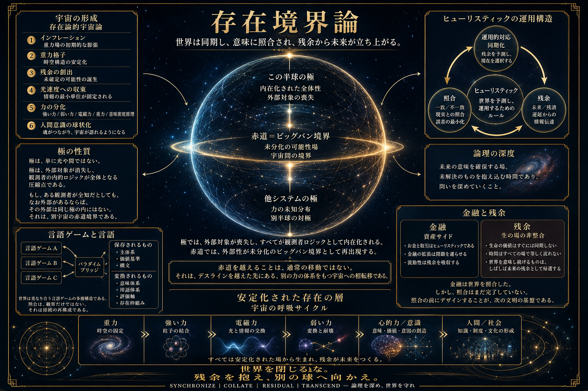

# Scientific Ontology｜存在境界論

## Conceptual Interaction and Boundary Studies

> Layer: Repository root  
> Status: Public interface README  
> Scope: Overview, reading guide, repository navigation, and release-level orientation  
> Language: English-first public entrance; Japanese remains the primary conceptual reference where meanings diverge  
> Public profile: P0 / repository entrance  
> Claim strength: Mixed; overview only. Detailed claim strength is managed in [`05_Research_Notes/Claim_Strength_and_Publication_Layer_Table.md`](../../CURRENT_WORK_SPACE/Claim_Strength_and_Publication_Layer_Tablex.md).

---

## 1. What This Is / これは何か

**Scientific Ontology｜存在境界論** is a public conceptual framework for describing existence through history, observation, boundary, communication, meaning, ethics, residuals, and re-collation.

This repository is designed as an English-accessible public entrance.  
Many readers will encounter this project first through English, so this README gives an English-first overview while preserving the Japanese conceptual ground.

Scientific Ontology does not treat existence as a substance to be directly possessed or exhaustively defined. Its public object is boundary: contact, history, return, residual formation, and subsequent conditions. In this sense, Boundary Realism is not a retreat from ontology, but the public form of ontology adopted here.

存在境界論は、存在そのものを直接所有し、定義し尽くす体系ではありません。公開上の対象は、境界です。すなわち、接触、履歴、返り、残差形成、後続条件です。この意味で、境界実在性は存在論からの後退ではなく、本リポジトリにおける存在論の公開形式です。

Scientific Ontology is not a replacement for modern science, empirical physics, social science, philosophy, theology, literary studies, ethics, or AI research. At the same time, it is not subordinate to those fields as a merely illustrative or decorative framework.

It is a boundary-realistic framework for examining how concepts, histories, boundaries, meanings, residuals, and return paths interact, diverge, compete, and become re-collatable across domains.

存在境界論は、現代科学、経験物理学、社会科学、哲学、神学、文学研究、倫理学、AI研究を置き換える体系ではありません。同時に、それらの領域に従属する単なる説明用・装飾用の枠組みでもありません。

存在境界論は、概念・履歴・境界・意味・残差・帰還経路が、領域を横断してどのように相互作用し、分岐し、競合し、再照合可能になるのかを扱う、境界実在論的な概念体系です。

---

## 2. Purpose / 目的

The purpose of Scientific Ontology is not to deny existing fields, nor to overwrite them.

Its purpose is to build a re-collatable conceptual apparatus for handling history, boundary, meaning, residuals, residues, and return conditions.

The guiding question is:

**How can we create a world that is more resilient, less fragile, and easier to inhabit with genuine understanding?**

存在境界論の目的は、既存分野を否定することでも、上書きすることでもありません。

目的は、履歴・境界・意味・残差・残渣・帰還条件を扱うための、再照合可能な概念装置を整えることです。

根にある問いは、次のものです。

**どうすれば、より壊れにくく、納得しやすく、生きやすい世界を創造できるのか。**

This is both an intellectual inquiry and a practical heuristic project.

It treats reality not only as something to be synchronized with, but as something to be collated, tested, reopened, and revised through residuals, counterexamples, failures, and unresolved differences.

これは、知的探求であると同時に、実践的なヒューリスティック検証の試みでもあります。

存在境界論は、現実を単に「同期すべき対象」としてだけでは扱いません。  
現実との同期を重視しつつ、その後に照合を行い、反例、失敗、残差、未解決の差分を通じて、概念を再び開き、更新していきます。

---

## 3. Method and Principles / 方法と原則

Scientific Ontology begins with concepts, then collates them against facts, histories, observations, boundary conditions, counterexamples, and residuals.

It does not end at correspondence.

A concept may correspond operationally with reality for a time.  
But correspondence alone is not enough.  
The framework asks what the correspondence means, where it fails, what it excludes, what residuals remain, and what residues are being produced outside the visible system.

存在境界論は、先に概念を置き、それを事実、履歴、観測、境界条件、反例、残差と照合します。

ただし、同期だけでは終わりません。

ある概念が、現実と一時的に同期することはあります。  
しかし、同期だけでは不十分です。  
その同期が何を意味するのか、どこで失敗するのか、何を排除しているのか、どの残差が残っているのか、そして見えない場所にどの残渣が生じているのかを読む必要があります。

Scientific Ontology follows these principles:

- Do not deny existing systems carelessly.
- Do not overwrite them by force.
- Do not hand authority back to them uncritically.
- Respect standard definitions when using established terms.
- Mark reinterpretation, analogy, and internal definitions clearly.
- Manage claim strength rather than weakening the theory.
- Treat counterexamples and failures as resources for re-collation.
- Preserve residuals instead of forcing false closure.

存在境界論の原則は次の通りです。

- 既存体系を安易に否定しない。
- 既存体系を強引に上書きしない。
- 既存体系へ無批判に権威を再譲渡しない。
- 確立された用語を使う場合は、標準定義を尊重する。
- 再解釈、アナロジー、内部定義を明示する。
- 理論を弱めるのではなく、主張強度を管理する。
- 反例や失敗を、再照合の資源として扱う。
- 偽って閉じるのではなく、残差を保持する。

---

## 4. v4.2.0 Reading Route / v4.2.0 読み順

For v4.2.0, the recommended reading route is:

1. Start with this README.
2. Read the system map and terminology protocol.
3. Read the physics correspondence policy before interpreting physics-adjacent vocabulary.
4. Read Boundary Realism Principle as the ontological anchor for the Sat / Truth layer.
5. Use Research Notes Index to navigate exploratory, cross-domain, literary, social, and physical-cosmological notes.
6. Use the claim-strength table to distinguish public layer, hypothesis strength, empirical distance, and publication handling.

v4.2.0 では、次の順序で読むことを推奨します。

1. まず、この README を読む。
2. 体系マップと用語規約を読む。
3. 物理近接語彙を読む前に、物理対応方針を読む。
4. Sat / Truth 層の存在論的支点として、境界実在性原理を読む。
5. Research Notes Index を使い、探索ノート、横断領域、文学、社会、物理・宇宙論系ノートへ進む。
6. 主張強度表を使い、公開層、仮説強度、経験的距離、公開上の扱いを区別する。

Core v4.2.0 orientation documents:

- [`00_Overview/Scientific_Ontology_System_Map.md`](./00_Overview/Scientific_Ontology_System_Map.md)
- [`00_Overview/Scientific_Terminology_Protocol.md`](./00_Overview/Scientific_Terminology_Protocol.md)
- [`00_Overview/Physics_Correspondence_Policy.ja.md`](./00_Overview/Physics_Correspondence_Policy.ja.md)
- [`00_Overview/Physics_Correspondence_Policy.en.md`](./00_Overview/Physics_Correspondence_Policy.en.md)
- [`01_Sat_Truth/Boundary_Realism_Principle.md`](./01_Sat_Truth/Boundary_Realism_Principle.md)
- [`05_Research_Notes/Research_Notes_Index.md`](./05_Research_Notes/Research_Notes_Index.md)
- [`05_Research_Notes/Claim_Strength_and_Publication_Layer_Table.md`](../../CURRENT_WORK_SPACE/Claim_Strength_and_Publication_Layer_Tablex.md)

---

## 5. Minimal Conceptual Entrance / 最小概念入口

This README only introduces the minimum conceptual entrance.  
For definitions, claim strengths, and detailed explanations, follow the directory links below.

この README では、入口概念だけを示します。  
詳細な定義、主張強度、説明は、各ディレクトリおよび用語集を参照してください。

### Four Axioms of Existence / 存在の四大表公理

The Four Axioms of Existence provide the public entrance to the framework:

1. Reality = sliced boson field
2. Observation = history encounter
3. Meaning = closed communication loop
4. Ethics = non-destructive interaction between histories

存在の四大表公理は、存在境界論への入口です。

1. 現実とは、切り出されたボソン場である。
2. 観測とは、履歴との出会いである。
3. 意味とは、閉じたコミュニケーションループである。
4. 倫理とは、履歴を破壊しない交流である。

See: [`01_Sat_Truth/Four_Axioms_of_Existence.md`](./01_Sat_Truth/Four_Axioms_of_Existence.md)

### Boundary / 境界

A boundary is not only a wall.  
It is the surface where external event-streams and internal history make contact, transform, resist, pass, or remain unresolved.

境界とは、単なる壁ではありません。  
外部事象流と内部履歴が接触し、変換され、抵抗し、通過し、あるいは未解決として残る面です。

See: [`03_Tam_Goodness/Boundary_Ethics_Model.md`](./03_Tam_Goodness/Boundary_Ethics_Model.md)

### Boundary Realism / 境界実在性

Boundary realism does not claim that every appearance should be treated as an independent substance.  
It treats boundary, contact, history, return, and subsequent conditions as the primary publicly manageable realities.

境界実在性は、現れたものをそのまま独立実体として存在と呼ぶ立場ではありません。  
公開上、実在的に扱えるものを、境界、接触、履歴、返り、後続条件として捉えます。

See: [`01_Sat_Truth/Boundary_Realism_Principle.md`](./01_Sat_Truth/Boundary_Realism_Principle.md)

### Entropy and Negentropy / エントロピーとネゲントロピー

Entropy is treated not only as disorder, but as a condition of difference, diffusion, unresolved communication, and residual formation.

Negentropy is treated as the recovery, preservation, or reorganization of meaning, order, value, responsibility, and history.

エントロピーは、単なる無秩序ではなく、差異、拡散、未解決通信、残差形成の条件として扱われます。

ネゲントロピーは、意味、秩序、価値、責任、履歴を回収・保存・再編成する働きとして扱われます。

See:

- [`05_Research_Notes/Social_Boundary_Notes/Negentropy_Economy_and_Meaning_Generation.ja.md`](./05_Research_Notes/Social_Boundary_Notes/Negentropy_Economy_and_Meaning_Generation.ja.md)
- [`05_Research_Notes/Social_Boundary_Notes/Negentropy_Economy_and_Meaning_Generation.en.md`](./05_Research_Notes/Social_Boundary_Notes/Negentropy_Economy_and_Meaning_Generation.en.md)
- [`05_Research_Notes/Social_Boundary_Notes/Negentropy_Economy_Principles.ja.md`](./05_Research_Notes/Social_Boundary_Notes/Negentropy_Economy_Principles.ja.md)
- [`05_Research_Notes/Social_Boundary_Notes/Negentropy_Economy_Principles.en.md`](./05_Research_Notes/Social_Boundary_Notes/Negentropy_Economy_Principles.en.md)

### Intrinsic Time / 内在時間

Intrinsic time is not clock time.  
It refers to the internal order in which histories are updated, folded, synchronized, reinterpreted, or deepened.

内在時間とは、時計時間ではありません。  
履歴が更新され、折り畳まれ、同期し、再解釈され、深度化される内部的順序を指します。

See:

- [`GLOSSARY.md`](GLOSSARY.md)
- [`05_Research_Notes/Physical_Cosmological_Notes/Intrinsic_Time_Standard_Model_Correspondence.ja.md`](./05_Research_Notes/Physical_Cosmological_Notes/Intrinsic_Time_Standard_Model_Correspondence.ja.md)
- [`05_Research_Notes/Physical_Cosmological_Notes/Intrinsic_Time_Standard_Model_Correspondence.en.md`](./05_Research_Notes/Physical_Cosmological_Notes/Intrinsic_Time_Standard_Model_Correspondence.en.md)

### Logical-depth Axis / 論理-深度軸

The logical-depth axis is not simply before and after in external time.  
It is a depth direction in which unresolved problems, contradictions, branches, residuals, residues, and semantic pressure are held and reconstructed.

論理-深度軸とは、外的時間における前後関係そのものではありません。  
未解決、矛盾、分岐、残差、残渣、意味圧を保持し、再構成するための深度方向です。

See:

- [`05_Research_Notes/Physical_Cosmological_Notes/Chaos_Theory_and_Logical_Depth_Axis.ja.md`](./05_Research_Notes/Physical_Cosmological_Notes/Chaos_Theory_and_Logical_Depth_Axis.ja.md)
- [`05_Research_Notes/Physical_Cosmological_Notes/Chaos_Theory_and_Logical_Depth_Axis.en.md`](./05_Research_Notes/Physical_Cosmological_Notes/Chaos_Theory_and_Logical_Depth_Axis.en.md)
- [`05_Research_Notes/Claim_Strength_and_Publication_Layer_Table.md`](../../CURRENT_WORK_SPACE/Claim_Strength_and_Publication_Layer_Tablex.md)

---

## 6. Position Relative to Science / 科学に対する立場

Scientific Ontology does not reject modern science.

It treats modern science as a powerful heuristic system formed through observation, measurement, objectification, causality, temporality, institutional practice, and conceptual habit.

However, Scientific Ontology does not begin from the same explanatory ground.

Modern physics generally begins from high-entropy observational surfaces, measurements, and distributions of phenomena, and extracts low-entropy laws, symmetries, and conservation structures.

AMP/ITS begins from low-entropy primordial activity, boundary formation, and history-generating structure, then descends toward the physical phase.

The two approaches may intersect and compete on shared physical vocabulary, but they do not originate from the same explanatory ground.

存在境界論は、現代科学を否定しません。

現代科学を、観測、測定、対象化、因果、時間、制度的実践、概念上の習慣によって形成された、強力なヒューリスティック体系として扱います。

ただし、存在境界論は、現代物理学と同じ本拠地から物理へ入るものではありません。

現代物理学は一般に、高エントロピーな観測面、測定値、現象分布から、低エントロピーな法則、対称性、保存則を抽出します。

AMP/ITS は、低エントロピーな根源的活動、境界形成、履歴生成構造から出発し、そこから物理位相へ降ります。

そのため、両者は物理語彙・法則・観測概念の共有平面で接触し、競合しうるが、説明の本拠地は同一ではありません。

For details, see:

- [`00_Overview/Physics_Correspondence_Policy.ja.md`](./00_Overview/Physics_Correspondence_Policy.ja.md)
- [`00_Overview/Physics_Correspondence_Policy.en.md`](./00_Overview/Physics_Correspondence_Policy.en.md)
- [`02_Raj_Beauty/Scientific_Ontology_and_Science.md`](./02_Raj_Beauty/Scientific_Ontology_and_Science.md)
- [`00_Overview/Scientific_Terminology_Protocol.md`](./00_Overview/Scientific_Terminology_Protocol.md)

---

## 7. Research Notes and Claim Strength / 研究ノートと主張強度

Research notes are exploratory and may include stronger hypotheses, cross-domain readings, physics-adjacent vocabulary, literary ontology, social boundary analysis, and application-facing observations.

They are not all placed at the same publication layer.  
Some notes are public conceptual bridges.  
Some are high-risk hypotheses.  
Some are literary or structural readings.  
Some are retained as heuristic models rather than empirical claims.

The repository therefore separates research navigation from claim-strength management.

研究ノートは探索層であり、強い仮説、横断領域読解、物理近接語彙、文学的存在論、社会境界分析、応用接続的観測を含みます。

それらは、すべて同じ公開層に置かれるわけではありません。  
公開可能な概念橋もあれば、リスクの高い仮説もあります。  
文学的・構造的読解もあれば、経験的主張ではなくヒューリスティックモデルとして保持されるものもあります。

そのため、本リポジトリでは、研究ノートの索引と主張強度管理を分離しています。

Primary navigation:

- [`05_Research_Notes/README.md`](./05_Research_Notes/README.md)
- [`05_Research_Notes/Research_Notes_Index.md`](./05_Research_Notes/Research_Notes_Index.md)
- [`05_Research_Notes/Claim_Strength_and_Publication_Layer_Table.md`](../../CURRENT_WORK_SPACE/Claim_Strength_and_Publication_Layer_Tablex.md)

Main research-note areas:

- [`05_Research_Notes/AI_Personality_Notes/`](./05_Research_Notes/AI_Personality_Notes/README.md)
- [`05_Research_Notes/Physical_Cosmological_Notes/`](./05_Research_Notes/Physical_Cosmological_Notes/README.md)
- [`05_Research_Notes/Social_Boundary_Notes/`](./05_Research_Notes/Social_Boundary_Notes/README.md)
- [`05_Research_Notes/Literary_Ontological_Notes/`](./05_Research_Notes/Literary_Ontological_Notes/README.md)
- [`05_Research_Notes/Cross_Domain_Ontological_Notes/`](./05_Research_Notes/Cross_Domain_Ontological_Notes/README.md)

---

## 8. Repository Map / リポジトリ構成

For detailed descriptions, open the README in each directory.  
詳細は、各ディレクトリの README を参照してください。

- [`00_Overview/`](./00_Overview/README.md)  
  Reading guide, system map, terminology protocol, physics correspondence policy, publication policy, translation note, and term-collision control.  
  読み方、体系マップ、用語規約、物理対応方針、公開方針、翻訳注記、用語衝突管理。

- [`01_Sat_Truth/`](./01_Sat_Truth/README.md)  
  Metaphysical foundations: AMP, Four Axioms, meaning generation, Boundary Epistemological Critique, and Boundary Realism Principle.  
  形而上学的基礎。AMP、四大表公理、意味生成、境界認識批判、境界実在性原理。

- [`02_Raj_Beauty/`](./02_Raj_Beauty/README.md)  
  Boundary dynamics, HFC, History-Field Topology, and connection with science.  
  境界動態、HFC、履歴場トポロジー、科学との接続面。

- [`03_Tam_Goodness/`](./03_Tam_Goodness/README.md)  
  Boundary ethics, residual handling, false closure, and return paths.  
  境界倫理、残差処理、偽閉鎖、意味の帰還。

- [`04_Applications/`](./04_Applications/README.md)  
  Public-facing application layer, including AI boundary concepts, AI adoption guidance, and implementation-oriented documents.  
  AI境界概念、AI導入のガイダンス、および実装に焦点を当てたドキュメントを含む、公開可能な応用・実装接続層。

- [`05_Research_Notes/`](./05_Research_Notes/README.md)  
  Exploratory notes, stronger hypotheses, physical correspondence candidates, social boundary analysis, literary-ontological readings, and cross-domain ontological notes.  
  探索ノート、強い仮説、物理接続候補、社会境界分析、文学的・存在論的読解、横断領域ノート。

- [`06_Visual_Materials/`](./06_Visual_Materials/README.md)  
  Conceptual posters and visual orientation materials.  
  概念ポスターと視覚的導入資料。

- [`99_Private_Core_Not_Included/`](./99_Private_Core_Not_Included/README.md)  
  Boundary marker showing what is intentionally excluded from the public repository.  
  公開リポジトリに含めない非公開中核の境界標識。

For research milestones and development policy, see:

- [`Roadmap.md`](./Roadmap.md)

研究上の到達点と発展方針については、以下を参照してください。

- [`Roadmap.md`](./Roadmap.md)

---

## 9. Visual Overview / 視覚的概要

The poster is a visual entrance, not a substitute for the documents.

ポスターは視覚的な入口であり、本文書群の代替ではありません。

- [Japanese poster / 日本語版ポスター](./06_Visual_Materials/Scientific_Ontology_Conceptual_Poster.ja.png)
- [English poster / 英語版ポスター](./06_Visual_Materials/Scientific_Ontology_Conceptual_Poster.en.png)
- [Visual Materials README / 視覚資料 README](./06_Visual_Materials/README.md)
- [Companion note / 読解注記](./06_Visual_Materials/Scientific_Ontology_Conceptual_Poster_Note.md)

---

## 10. Public Scope / 公開範囲

This repository is a public interface.

It does not include:

- full AMP Core
- full ITS theory
- private axiomatic drafts
- non-public implementation schemas
- non-public runtime documentation
- detailed operational parameters
- non-public simulation specifications
- personality/runtime core materials
- private persona or soul-core specifications

本リポジトリは公開用インターフェースです。

以下は含みません。

- AMP Core 全文
- ITS理論全体
- 非公開公理草案
- 非公開実装スキーマ
- 非公開ランタイム資料
- 詳細な運用パラメータ
- 非公開シミュレーション仕様
- 人格OS・ランタイム中核資料
- 非公開人格・Soul Core 仕様

---

## 11. Publication, Translation, and Terminology / 公開・翻訳・用語管理

This repository treats Japanese descriptions as the primary conceptual reference where meanings diverge.  
English terms are commensurated renderings, not fixed word-for-word translations.

For publication, translation, commensuration, and terminology-collision management, see:

- [`Publication_and_Commensuration_Policy.md`](./Publication_and_Commensuration_Policy.md)
- [`Translation_Note.md`](./Translation_Note.md)
- [`TERM_COLLISION_REGISTRY.md`](./TERM_COLLISION_REGISTRY.md)
- [`TERM_COLLISION_REGISTRY.en.md`](./TERM_COLLISION_REGISTRY.en.md)
- [`GLOSSARY.md`](GLOSSARY.md)

本リポジトリでは、意味が分岐する場合、日本語記述を主要な概念参照として扱います。  
英語表記は、固定された逐語訳ではなく、通約表現です。

公開、翻訳、通約、用語衝突管理については、以下を参照してください。

- [`Publication_and_Commensuration_Policy.md`](./Publication_and_Commensuration_Policy.md)
- [`Translation_Note.md`](./Translation_Note.md)
- [`TERM_COLLISION_REGISTRY.md`](./TERM_COLLISION_REGISTRY.md)
- [`TERM_COLLISION_REGISTRY.en.md`](./TERM_COLLISION_REGISTRY.en.md)
- [`GLOSSARY.md`](GLOSSARY.md)

---

## 12. Citation and DOI / 引用・DOI

Use the version-specific DOI when citing a specific release.

Current public edition DOI:

[10.5281/zenodo.21240120](https://doi.org/10.5281/zenodo.21240120)

For citation details and related identifiers, see:

- [`CITATION.md`](./CITATION.md)
- [`CITATION.cff`](./CITATION.cff)
- [`RELEASE_NOTES.md`](./RELEASE_NOTES.md)

特定のリリースを引用する場合は、版固有 DOI を使用してください。

現行公開版 DOI:

[10.5281/zenodo.21240120](https://doi.org/10.5281/zenodo.21240120)

引用形式および関連識別子については、以下を参照してください。

- [`CITATION.md`](./CITATION.md)
- [`CITATION.cff`](./CITATION.cff)
- [`RELEASE_NOTES.md`](./RELEASE_NOTES.md)

---

## 13. License / ライセンス

From v3.0.0 onward, this repository is licensed under Creative Commons Attribution 4.0 International (CC BY 4.0) unless otherwise stated.

For details, see:

- [`LICENSE.md`](./LICENSE.md)

v3.0.0 以降、本リポジトリの内容は、特に明記がない限り、Creative Commons Attribution 4.0 International（CC BY 4.0）のもとで公開します。

詳細は以下を参照してください。

- [`LICENSE.md`](./LICENSE.md)

---

